  

   

  <a href="https://jugsec.com"><strong>Portfolio ↗</strong></a> ·
  <a href="https://www.linkedin.com/in/theoperson">LinkedIn</a> ·
  <a href="https://x.com/JUG_SEC">X</a> ·
  <a href="mailto:theo.person@epsi.fr">Email</a>

## About

I'm an **AI Project Manager at [Weenove](https://www.weenove.fr/)** and a product-minded builder based between France and the UK. I work where **AI delivery, data, LLM engineering, and web products** meet—turning ambiguous ideas into clear, useful systems.

### Now

- Leading AI projects from discovery through delivery
- Exploring practical LLM workflows, analytics, and AI-assisted products
- Building focused tools around esports, automation, and polished web experiences

## Selected work

**[Rareness ↗](https://github.com/TheoPerson/Rareness)** · [live demo](https://rareness.vercel.app)  
League of Legends skin collection with a focused web interface for browsing and tracking assets. `Web` · `Frontend` · `Data`

**[JUG_SEC.COM V2 ↗](https://github.com/TheoPerson/JUG_SEC.COM---V2)**  
The second iteration of my personal portfolio and hub, with a stronger visual direction and clearer product surface. `HTML` · `CSS` · `JavaScript`

**[Calendar Feeds ↗](https://github.com/TheoPerson/Feed)**  
Subscription-ready `.ics` feeds for CS2, R6, and sports events across Google, Apple, and Outlook calendars. `Automation` · `ICS` · `Esports`

**[Responsive Dashboard ↗](https://github.com/TheoPerson/WEB-RESPONSIVE-WET)**  
A multi-page frontend study spanning analytics, chat, calendars, and responsive layouts. `HTML` · `CSS` · `JavaScript`

## Toolbox

  

 

AI & data · LLM workflows · Python · Analytics &nbsp; • &nbsp; Web · TypeScript · JavaScript · Node.js · PHP &nbsp; • &nbsp; Delivery · Product strategy · Project management · GitHub

## Activity

  <picture>
    <source media="(prefers-color-scheme: dark)" srcset="https://github-readme-stats.vercel.app/api?username=TheoPerson&amp;show_icons=true&amp;hide_border=true&amp;rank_icon=github&amp;bg_color=00000000&amp;title_color=A5B4FC&amp;text_color=8B949E&amp;icon_color=7C3AED" />
    <source media="(prefers-color-scheme: light)" srcset="https://github-readme-stats.vercel.app/api?username=TheoPerson&amp;show_icons=true&amp;hide_border=true&amp;rank_icon=github&amp;bg_color=00000000&amp;title_color=4F46E5&amp;text_color=475569&amp;icon_color=7C3AED" />
    
  </picture>

 

Build with intent. Ship with clarity.

