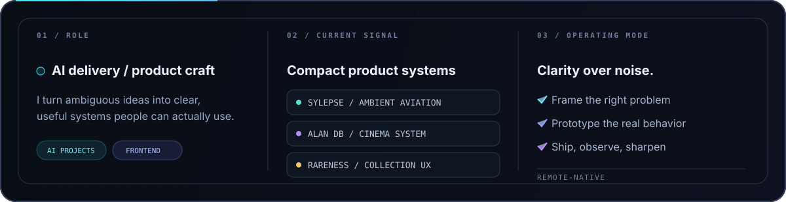
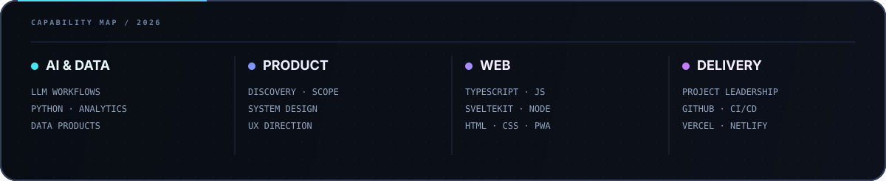

  

   

  <a href="https://alandatabase.com"><strong>Live products ↗</strong></a>
  &nbsp;·&nbsp;
  <a href="https://www.linkedin.com/in/theoperson">LinkedIn</a>
  &nbsp;·&nbsp;
  <a href="https://x.com/JUG_SEC">X / @JUG_SEC</a>
  &nbsp;·&nbsp;
  <a href="mailto:theo.person@epsi.fr">Email</a>

 

## Selected systems

  <a href="https://sylepse-v2-app.netlify.app"><strong>Open live app ↗</strong></a>
  &nbsp;·&nbsp;
  <a href="https://github.com/TheoPerson/Sylepse">Source</a>

 

  <a href="https://alandatabase.com"><strong>Visit product ↗</strong></a>
  &nbsp;·&nbsp;
  <a href="https://github.com/TheoPerson/the-alans-data-base">Source</a>

 

  <a href="https://rareness.vercel.app"><strong>Open live app ↗</strong></a>
  &nbsp;·&nbsp;
  <a href="https://github.com/TheoPerson/Rareness">Source</a>

## Operating stack

 

  <a href="https://github.com/TheoPerson?tab=repositories"><strong>Explore all repositories</strong></a>
  &nbsp;·&nbsp;
  <a href="https://github.com/TheoPerson?tab=stars">Signals I follow</a>

 

